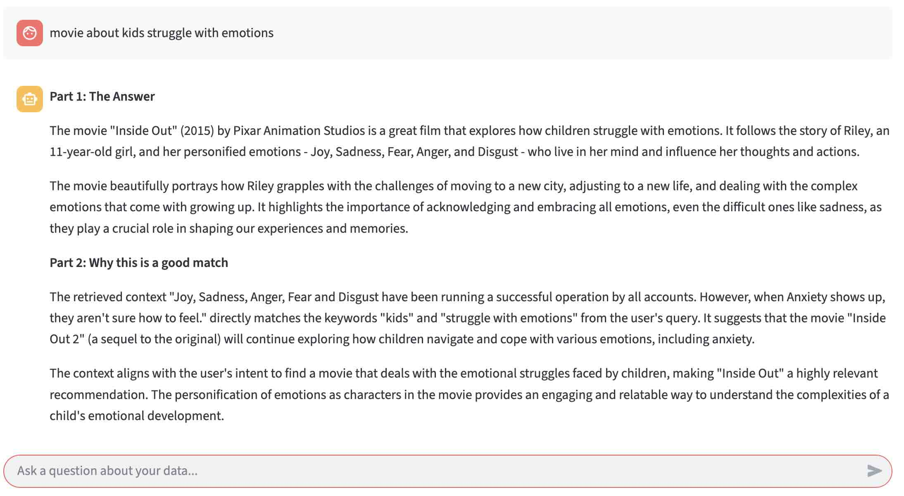

# 🤖 AWS Bedrock & MongoDB Atlas AI Agent

This project is a Python-based RAG (Retrieval-Augmented Generation) application that acts as an intelligent agent. It uses **Streamlit** for the frontend, **AWS Bedrock** (Claude 3 Sonnet + Titan Embeddings V2) for reasoning and vectorization, and **MongoDB Atlas** for vector storage and semantic search.

The agent takes user queries, searches a MongoDB knowledge base for relevant documents (vector search), and generates an answer along with an explanation of why the retrieved data is relevant.

## ✨ Features

* **Secure Authentication**: Input AWS credentials and MongoDB connection strings directly in the UI (never hardcoded).
* **Connection Testing**: "Test & Initialize" button verifies connectivity to AWS Bedrock and MongoDB before loading the chat.
* **Dynamic Field Mapping**: Configure which fields in your database contain the text used for embedding, the vector embeddings, and additional metadata (e.g., title, source) directly from the sidebar.
* **Smart Agent Workflow**:
    * Uses **Amazon Titan Text Embeddings V2** (1024 dimensions) to vectorize queries.
    * Performs semantic vector search on **MongoDB Atlas**.
    * Uses **Anthropic Claude 3 Sonnet** to synthesize answers.
    * **"Why this is a good match"**: The agent explicitly explains the relevance of the retrieved data.
* **Response Cleaning**: automatically parses and formats complex chain-of-thought outputs into clean Markdown.

## 🛠️ Tech Stack

* **Frontend**: [Streamlit](https://streamlit.io/)
* **LLM Orchestration**: [LangChain](https://www.langchain.com/)
* **LLM Provider**: AWS Bedrock (Anthropic Claude 3 Sonnet)
* **Embeddings**: AWS Bedrock (Amazon Titan Text V2)
* **Vector Database**: MongoDB Atlas (Vector Search)

## 📋 Prerequisites

1.  **Python 3.9+** installed.
2.  **AWS Account** with access to Bedrock models:
    * `anthropic.claude-3-sonnet-20240229-v1:0`
    * `amazon.titan-embed-text-v2:0`
3.  **MongoDB Atlas Cluster**: A cluster (free tier M0 works) with a configured **Vector Search Index**.

## 🚀 Setup & Installation

### Python Dependencies

Install the required Python packages:
```bash
pip install streamlit boto3 langchain-aws langchain-mongodb pymongo
```

### Create a Vector Search index 
```bash
{
  "fields": [
    {
      "numDimensions": 1024,
      "path": "embedding",   // "Vector Field Path" on UI input
      "similarity": "cosine",
      "type": "vector"
    }
  ]
}
```

## 🏃‍♂️ Usage

### Run the Streamlit application:
```bash
streamlit run ai_agent.py
```

Open the UI (typically ```http://localhost:8501```).

### Configure Sidebar:

* ***AWS Credentials***: Enter Access Key, Secret Key, Session Token (optional), and Region (e.g., us-east-1).
  

* ***MongoDB Config***: Enter Connection String, DB Name, Collection Name, and Index Name.
  

* ***Field Mappings***: Tell the app which fields in your JSON documents correspond to the Vector embedding, Text data used for embedding, and Metadata.

    * Vector Field: e.g., ```embedding```
    
    * Text Field: e.g., ```plot``` or ```description```
    
    * Additional Fields: e.g., ```title```, ```year```, ```genre```
  
  

Click "***Test & Initialize Connections***". If successful, the chat interface will appear.


### Chat: Ask questions about your data!



